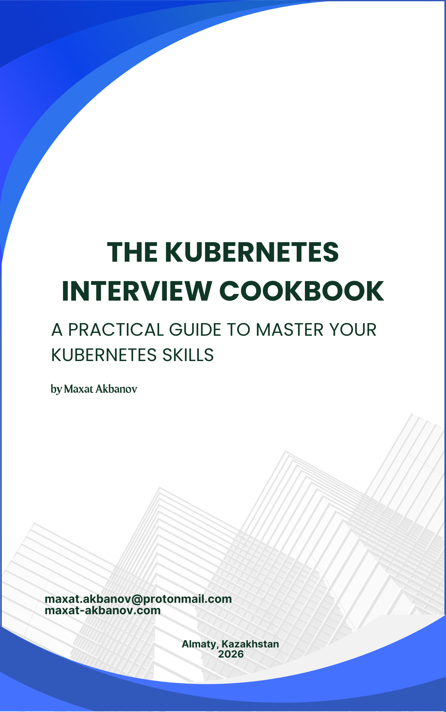

## The Kubernetes Interview Cookbook: A Practical Guide to Master Your Kubernetes Skills

This repository serves as the official companion resource for the book. It provides a comprehensive, structured collection of all practical exercises, labs, and scenario-based challenges detailed within the book.

