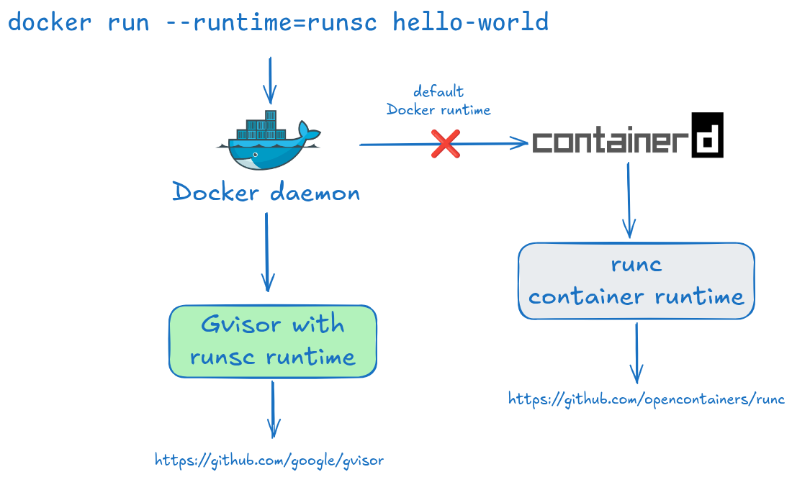
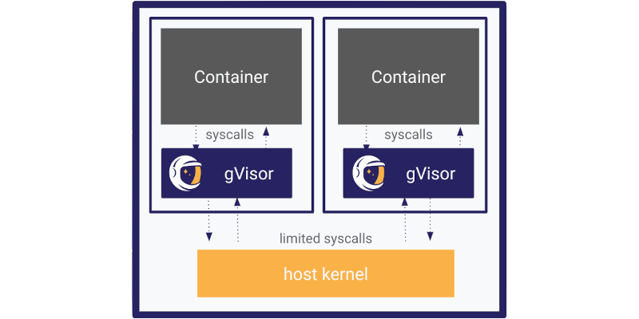

# Install gVisor and run a container with `--runtime=runsc`

## Ubuntu VM

Ubuntu VM already comes with `Docker` and `ctop` tools pre-installed. Installation script is written inside of `Vagrantfile` by using `shell` provisioner.

To check Docker version:
```bash
docker -v
```

[`ctop`](https://github.com/bcicen/ctop) is a `top` like CLI tool to view containers and metrics.

## Vagrant Commands

1. To start VM machine:
```bash
vagrant up
```
2. To pause VM:
```bash
vagrant halt
```
3. To ssh into VM:
```bash
vagrant ssh
```
4. To destroy VM:
```bash
vagrant destroy
```

## Installing Gvisor and Running Container

1. To install latest release of [Gvisor](https://gvisor.dev/docs/user_guide/install/):
```bash
(
  set -e
  ARCH=$(uname -m)
  URL=https://storage.googleapis.com/gvisor/releases/release/latest/${ARCH}
  wget ${URL}/runsc ${URL}/runsc.sha512 \
    ${URL}/containerd-shim-runsc-v1 ${URL}/containerd-shim-runsc-v1.sha512
  sha512sum -c runsc.sha512 \
    -c containerd-shim-runsc-v1.sha512
  rm -f *.sha512
  chmod a+rx runsc containerd-shim-runsc-v1
  sudo mv runsc containerd-shim-runsc-v1 /usr/local/bin
)
```
2. To install gVisor as a Docker runtime, run the following commands:
```bash
sudo /usr/local/bin/runsc install
sudo systemctl reload docker
```
3. Now run `hello-world` container by using `runsc` runtime:
```bash
docker run --runtime=runsc hello-world
```
4. Use `ctop` command to get the container id
5. To verify that it actually uses `runsc` runtime:
```bash
docker inspect <container_id> | grep -i runtime
```
You should see output similar to this:
```bash
"Runtime": "runsc",
"CpuRealtimeRuntime": 0,
```

## Why `runsc` in Docker?

Docker has a **pluggable runtime interface** ([OCI runtime spec](https://opencontainers.org/)). When you run a container, Docker doesn't directly execute processes — it delegates to an OCI-compatible runtime that actually creates the sandbox. For more information, see [Docker alternative container runtimes](https://docs.docker.com/engine/daemon/alternative-runtimes/).



Docker acts as a **management layer** (image pull, networking, volumes, CLI), and the runtime is what actually creates and runs the container process. [`runsc`](https://github.com/google/gvisor#what-is-gvisor) is one such runtime.

### The default runtime is `runc`

[`runc`](https://github.com/opencontainers/runc) is the reference OCI runtime, donated by Docker to the CNCF. It uses Linux **namespaces + cgroups** to isolate processes — the container process still makes syscalls directly to the host kernel.

| | `runc` (default) | `runsc` (gVisor) |
|---|---|---|
| Isolation | namespaces + cgroups | full syscall interception |
| Kernel exposure | host kernel | gVisor's kernel (Sentry) |
| Performance | near-native | overhead (~10–30%) |
| Attack surface | large | much smaller |

### Why this matters for security

With `runc`, a kernel exploit in a container can potentially escape to the host. With `runsc`, the container process never touches the real kernel directly — every syscall goes through gVisor's user-space kernel first, so a kernel exploit hits gVisor's Sentry, not your host.



*Image source: [gvisor.dev](https://gvisor.dev/)*

This is the core tradeoff `strace` will make visible: run `strace` on the same workload under both runtimes and you'll see the syscall patterns differ — under `runsc`, the container's syscalls are intercepted and re-implemented by gVisor.

## References
- [Medium Blog: Docker and OCI Runtimes](https://medium.com/@avijitsarkar123/docker-and-oci-runtimes-a9c23a5646d6)