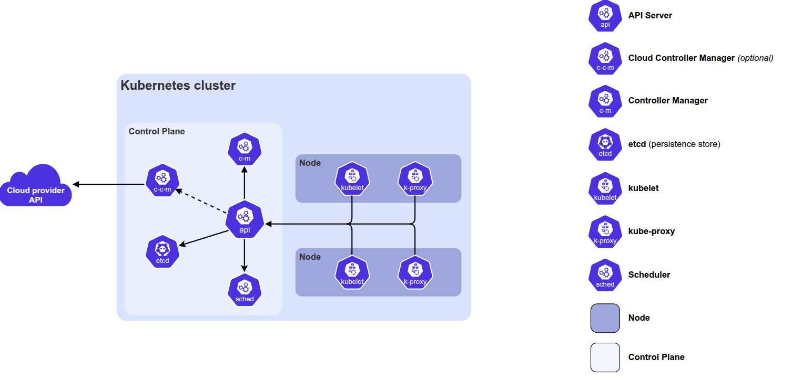
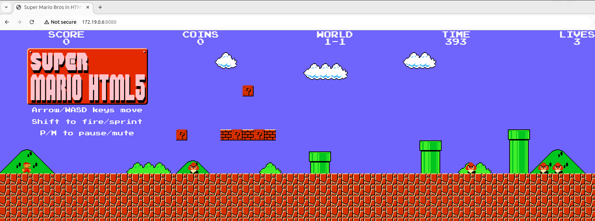

# Cloud Controller Manager

The [**Cloud Controller Manager (CCM)**](https://kubernetes.io/docs/concepts/architecture/cloud-controller/) is a control plane component that serves as a bridge between your Kubernetes cluster and a specific cloud provider's API. 



[Source](https://kubernetes.io/docs/concepts/architecture/cloud-controller/)

It handles cloud-specific tasks like automatically provisioning external Load Balancers, managing network routes, and syncing node status with cloud instances. By separating this logic into its own module, Kubernetes remains "cloud-neutral," allowing vendors like AWS or Google Cloud to update their integrations without changing the core Kubernetes code. This "out-of-tree" design significantly reduces the size of the main Kubernetes binary and speeds up the release of new cloud features. Ultimately, it ensures that your cluster can seamlessly interact with proprietary infrastructure while maintaining a consistent, open-source core.

## Practice

In this practice exercise you will see how *Cloud Controller Manager* works by provisioning *External Cloud Load Balancer with external IP*. In order to save the costs, practice exercise is done locally with `kind` cluster and simulates the working of cloud controller manager.

### Install kind

1. Install [`kind`](https://kind.sigs.k8s.io/docs/user/quick-start/#installing-with-a-package-manager) from [release](https://github.com/kubernetes-sigs/kind/releases) binaries:
```bash
[ $(uname -m) = x86_64 ] && curl -Lo ./kind https://kind.sigs.k8s.io/dl/v0.31.0/kind-linux-amd64
```
In our example we're installing [v0.31.0](https://github.com/kubernetes-sigs/kind/releases/tag/v0.31.0)

2. Make binary executable
```bash
chmod +x ./kind
```
3. Move binary:
```bash
sudo mv ./kind /usr/local/bin/kind
```
4. Check installation:
```bash
kind --version
```

### Install Kubernetes Cloud Provider for KIND

The [`cloud-provider-kind`](https://github.com/kubernetes-sigs/cloud-provider-kind?tab=readme-ov-file) is aimed to provide `kind` with additional capability to test and run applications with features that depend on cloud providers such as load balancers.

1. Install `cloud-provider-kind`:
```bash
go install sigs.k8s.io/cloud-provider-kind@latest
```
2. Make the executable available elsewhere:
```bash
sudo install ~/go/bin/cloud-provider-kind /usr/local/bin
```

### Run Cluster

1. Run a KIND cluster with 3 worker nodes:
```bash
kind create cluster --config kind-config.yaml --name multi-node-cluster
```
2. If you need to delete the cluster:
```bash
kind delete clusters --all
```
3. Configure access to the cluster:
```bash
kubectl cluster-info --context kind-multi-node-cluster
```
4. Check access to the cluster:
```bash
kubectl get nodes
```

### Running the Provider

Once the cluster is running, we need to run the `cloud-provider-kind` in a terminal and **keep it running**. The `cloud-provider-kind` will monitor all your KIND clusters and `Services` with Type `LoadBalancer` and create the corresponding LoadBalancer containers that will expose those `Services`:
```bash
cloud-provider-kind
```

### Creating a Service and exposing it via a LoadBalancer

Let's create a Mario Game application that listens on port 80 and expose it in the port 8080 using a LoadBalancer:

1. Apply the deployment and service config files:
```bash
kubectl apply -f cloud-controller-lb.yaml
```
2. Next, get the provisioned Load Balancer's external IP:
```bash
kubectl get service/lb-service-local
```
Output:
```bash
NAME               TYPE           CLUSTER-IP      EXTERNAL-IP   PORT(S)          AGE
lb-service-local   LoadBalancer   10.96.120.130   172.19.0.6    8080:31292/TCP   43s
```

3. In your browser, go to `http://172.19.0.6:8080/` and you should see the Mario Game launched:



This exercise shows how `cloud-controller-manager` works by provisioning external Load Balancer resource and exposes the Kubernetes service via it.