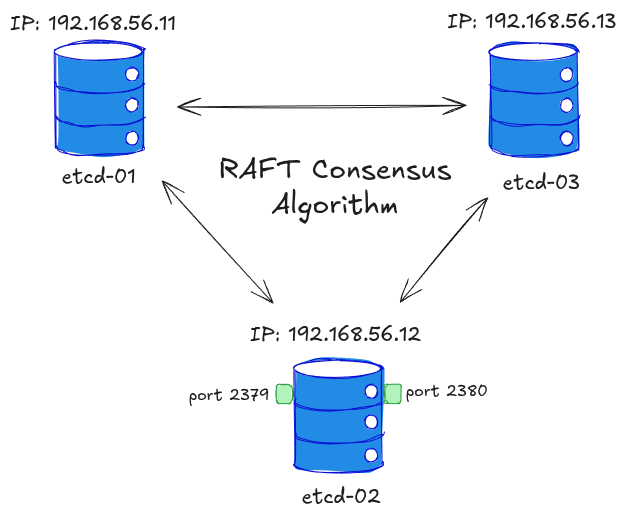

# Setup etcd Cluster on Ubuntu Linux Machines

In this exercise you will provision and configure etcd cluster on 3 Ubuntu 20.04 based VM machines.

The total number of nodes in etcd cluster is determined by the following formula:
```
N = 2F + 1

N - total number of nodes,
F - total number of failed nodes
``` 

The odd number of nodes is required in order to to keep an overall [quorum](https://etcd.io/docs/v3.3/faq/#:~:text=platform%20for%20more.-,Why%20an%20odd%20number%20of%20cluster%20members%3F,-An%20etcd%20cluster).

In our setup, we tolerate F=1 etcd node failure. In this case the total number of nodes is 3.

### Cluster Setup

Our setup with 3 VMs has the following:
- hostnames `etcd-01`, `etcd-02`, `etcd-03`
- `ufw` firewall installed
- ports 22, 2379, 2380 enabled
- IP addresses: `etcd-01 (192.168.56.11)`, `etcd-02 (192.168.56.12)`, `etcd-03 (192.168.56.13)` 
- [`etcd v3.6.6`](https://github.com/etcd-io/etcd/releases/tag/v3.6.6)



1. Provision VMs:
```bash
vagrant up
```
2. To connect to the machine:
```bash
vagrant ssh etcd-01
```
3. Check connection between all nodes:
```bash
ping 192.168.56.11
ping 192.168.56.12
ping 192.168.56.13
```

On all 3 nodes perform the following steps:

1. Change directory to `/usr/local/src`
```bash
cd /usr/local/src
```
2. Install `gettext` package for `envsubst` utility:
```bash
sudo apt update && sudo apt install -y gettext
```
3. Download the latest etcd release from the etcd [Github Releases](https://github.com/etcd-io/etcd/releases?ref=maxat-akbanov.com):
```bash
sudo wget "https://github.com/coreos/etcd/releases/download/v3.6.6/etcd-v3.6.6-linux-amd64.tar.gz"
```
4.  Untar the binary:
```bash
sudo tar -xvf etcd-v3.6.6-linux-amd64.tar.gz
```
5. Move the extracted `etcd` executables (`etcd` and `ectdctl`) to local bin:
```bash
sudo mv etcd-v3.6.6-linux-amd64/etcd* /usr/local/bin/
```
6. Create relevant `etcd` folders, user and group (Group ID `1501`). In our example the `etcd` service will be run by `etcd` user:
```bash
sudo mkdir -p /etc/etcd /var/lib/etcd
sudo groupadd -f -g 1501 etcd
sudo useradd -c "etcd user" -d /var/lib/etcd -s /bin/false -g etcd -u 1501 etcd
sudo chown -R etcd:etcd /var/lib/etcd
```
7. Create a systemd service file `/lib/systemd/system/etcd.service` for etcd. Replace `--listen-client-urls` with your server IPs:
```bash
sudo cat << 'ETCD_TEMPLATE' > /tmp/etcd.service.template
[Unit]
Description=etcd service
Documentation=https://github.com/coreos/etcd
 
[Service]
User=etcd
Type=notify
ExecStart=/usr/local/bin/etcd \
 --name ${ETCD_NAME} \
 --data-dir /var/lib/etcd \
 --initial-advertise-peer-urls http://${ETCD_HOST_IP}:2380 \
 --listen-peer-urls http://${ETCD_HOST_IP}:2380 \
 --listen-client-urls http://${ETCD_HOST_IP}:2379,http://127.0.0.1:2379 \
 --advertise-client-urls http://${ETCD_HOST_IP}:2379 \
 --initial-cluster-token etcd-cluster-1 \
 --initial-cluster etcd-01=http://192.168.56.11:2380,etcd-02=http://192.168.56.12:2380,etcd-03=http://192.168.56.13:2380 \
 --initial-cluster-state new \
 --heartbeat-interval 1000 \
 --election-timeout 5000
Restart=on-failure
RestartSec=5
 
[Install]
WantedBy=multi-user.target
ETCD_TEMPLATE
```
This file is an **etcd systemd service template** (`/tmp/etcd.service.template`) that defines how the Linux operating system (via `systemd`) should run and manage the etcd process. We need it because it ensures the etcd service is **automatically started** on boot, **restarted** upon failure, and runs under the correct security context (`User=etcd`). Crucially, it serves as a **single source template** where variables like `${ETCD_NAME}` and `${ETCD_HOST_IP}` are defined, allowing you to use a tool like `envsubst` to generate the correct, customized configuration file for each of the three cluster members.

8. Set the following environment variables for your node:
```bash
# For etcd-01:
export ETCD_NAME="etcd-01"
export ETCD_HOST_IP="192.168.56.11"
```
9. Use `envsubst` to replace variables and write the service file:
```bash
envsubst < /tmp/etcd.service.template | sudo tee /lib/systemd/system/etcd.service > /dev/null
```

### Bootstrap Cluster

Once all the configurations are applied on all nodes, we can start and enable etcd cluster service:
```bash
sudo systemctl daemon-reload
sudo systemctl enable etcd
sudo systemctl start etcd.service
sudo systemctl status -l etcd.service
```

`etcd.service` should be loaded and running:
```bash
🟢 etcd.service - etcd service
     Loaded: loaded (/lib/systemd/system/etcd.service; enabled; vendor preset: enabled)
     Active: active (running) since Mon 2025-12-15 06:10:04 UTC; 29min ago
       Docs: https://github.com/coreos/etcd
   Main PID: 15659 (etcd)
      Tasks: 7 (limit: 1117)
     Memory: 31.4M
     CGroup: /system.slice/etcd.service
             └─15659 /usr/local/bin/etcd --name etcd-01 --data-dir /var/lib/etcd --initial-advertise-peer-urls http://192>

Dec 15 06:10:43 etcd-01 etcd[15659]: {"level":"info","ts":"2025-12-15T06:10:43.926091Z","caller":"rafthttp/stream.go:248">
Dec 15 06:10:43 etcd-01 etcd[15659]: {"level":"info","ts":"2025-12-15T06:10:43.926653Z","caller":"rafthttp/stream.go:273">
Dec 15 06:10:43 etcd-01 etcd[15659]: {"level":"info","ts":"2025-12-15T06:10:43.927516Z","caller":"rafthttp/stream.go:248">
Dec 15 06:10:43 etcd-01 etcd[15659]: {"level":"info","ts":"2025-12-15T06:10:43.927937Z","caller":"rafthttp/stream.go:273">
Dec 15 06:10:44 etcd-01 etcd[15659]: {"level":"info","ts":"2025-12-15T06:10:44.262429Z","caller":"etcdserver/server.go:24>
Dec 15 06:10:44 etcd-01 etcd[15659]: {"level":"info","ts":"2025-12-15T06:10:44.268528Z","caller":"membership/cluster.go:6>
Dec 15 06:10:44 etcd-01 etcd[15659]: {"level":"info","ts":"2025-12-15T06:10:44.269598Z","caller":"api/capability.go:76",">
Dec 15 06:10:44 etcd-01 etcd[15659]: {"level":"info","ts":"2025-12-15T06:10:44.270976Z","caller":"etcdserver/server.go:24>
```

To check the cluster health:
```bash
etcdctl endpoint health \
  --endpoints=http://192.168.56.11:2379,http://192.168.56.12:2379,http://192.168.56.13:2379
```

You should see the output similar to this:
```bash
http://192.168.56.12:2379 is healthy: successfully committed proposal: took = 123.930137ms
http://192.168.56.13:2379 is healthy: successfully committed proposal: took = 128.259148ms
http://192.168.56.11:2379 is healthy: successfully committed proposal: took = 127.665849ms
```

To see the status and list of etcd cluster members:
```bash
etcdctl member list --write-out=table
```

Example output:
```bash
+------------------+---------+---------+---------------------------+---------------------------+------------+
|        ID        | STATUS  |  NAME   |        PEER ADDRS         |       CLIENT ADDRS        | IS LEARNER |
+------------------+---------+---------+---------------------------+---------------------------+------------+
|  60ff4084f695f91 | started | etcd-03 | http://192.168.56.13:2380 | http://192.168.56.13:2379 |      false |
| 6d36a224cc993604 | started | etcd-01 | http://192.168.56.11:2380 | http://192.168.56.11:2379 |      false |
| bb961ca5e3abf011 | started | etcd-02 | http://192.168.56.12:2380 | http://192.168.56.12:2379 |      false |
+------------------+---------+---------+---------------------------+---------------------------+------------+
```

### Write Key-Value Pairs

Writing and verifying key-value pairs is a fundamental operation for testing an etcd cluster.

1. First, make sure you define your cluster endpoints. You can run this command on any node that can reach the etcd client ports (2379):
```bash
# Define the cluster endpoints (replace with your actual IPs)
ETCD_ENDPOINTS="http://192.168.56.11:2379,http://192.168.56.12:2379,http://192.168.56.13:2379"
```
2. The `put` command is used to write a key and its associated value:
```bash
etcdctl put /test/environment "production" --endpoints=${ETCD_ENDPOINTS}
```
You should see `OK` message.
3. Write a second key-value pair:
```bash
etcdctl put /test/version "1.0.0" --endpoints=${ETCD_ENDPOINTS}
```
4. The `get` command is used to retrieve a specific key's value:
```bash
etcdctl get /test/environment --endpoints=${ETCD_ENDPOINTS}
```
Expected output:
```bash
/test/environment
production
```
5. Retrieve the second key:
```bash
etcdctl get /test/version --endpoints=${ETCD_ENDPOINTS}
```
Expected output:
```bash
/test/version
1.0.0
```
6. To confirm that both keys exist and to verify a directory structure, you can use the `--prefix` flag to retrieve all keys starting with a given prefix (e.g., all keys under `/test/`):
```bash
etcdctl get /test/ --prefix --endpoints=${ETCD_ENDPOINTS}
```

### References
- [etcd.io/docs/v3.6/quickstart/](https://etcd.io/docs/v3.6/quickstart/)
