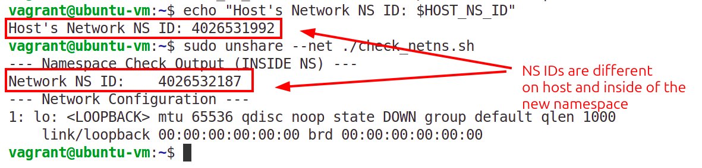

# Linux Namespaces

[Linux namespaces](https://man7.org/linux/man-pages/man7/namespaces.7.html) are a fundamental feature of the Linux kernel that **isolates and virtualizes system resources** for a group of processes. 

They achieve this by creating a separate instance of a global resource that is only visible to the processes within that namespace. This gives the processes the illusion that they have their own isolated copy of that resource, even though they are sharing the same underlying kernel.

## **Key Namespaces**

The main namespaces include:

* **PID (Process ID):** Isolates the process ID space. Processes in different PID namespaces can have the same PID. Essential for containers.
* **NET (Network):** Isolates network devices, IP addresses, routing tables, and firewall rules. Each namespace has its own virtual network stack.
* **MNT (Mount):** Isolates the filesystem mount points. Processes in a namespace see a unique set of mounted filesystems.
* **UTS (UNIX Time-sharing System):** Isolates the hostname and domain name.
* **IPC (Interprocess Communication):** Isolates IPC resources like message queues and semaphores.
* **USER:** Isolates user and group IDs, allowing a user in a container to be *root* without being *root* on the host system.
* **CGROUP:** Isolates the view of the cgroup hierarchy.

## **Why are they important?**

They are the primary technological building blocks for **Linux Containers** (like [Docker](https://www.docker.com/) and [LXC](https://linuxcontainers.org/)), as they provide the necessary process and resource isolation to make containers lightweight and secure.

## Practice

In this exercise 

1. Run Ubuntu VM from `vm` folder:
```bash
vagrant up
```
If you need to destroy the machine:
```bash
vagrant destroy
```
2. To connect to the machine:
```bash
vagrant ssh
```
3. To list all namespaces:
```bash
lsns
```
Output:
```bash
        NS TYPE   NPROCS   PID USER    COMMAND
4026531835 cgroup      3  6718 vagrant /lib/systemd/systemd --user
4026531836 pid         3  6718 vagrant /lib/systemd/systemd --user
4026531837 user        3  6718 vagrant /lib/systemd/systemd --user
4026531838 uts         3  6718 vagrant /lib/systemd/systemd --user
4026531839 ipc         3  6718 vagrant /lib/systemd/systemd --user
4026531840 mnt         3  6718 vagrant /lib/systemd/systemd --user
4026531992 net         3  6718 vagrant /lib/systemd/systemd --user
```
4. To list the namespaces of the specific process:
```bash
lsns -p <pid>
```
5. To list all the processes of the namespace:
```bash
lsns <NAMESPACE_ID>
```
For example:
```bash
lsns 4026531837
```
Output:
```bash
  PID  PPID USER    COMMAND
 6718     1 vagrant /lib/systemd/systemd --user
 6822  6821 vagrant -bash
 7208  6822 vagrant └─lsns 4026531837
```
- PID - The ID of the process
- PPID - The ID of the parent process
- USER - The name of the user owning the process
- COMMAND - The command of the process

### Run processes inside new Linux namespaces 

In this exercise you'll see that the same program running on host's namespace and inside of a newly created network namespace, have different IDs.

1. Create sample script `check_netns.sh`:
```bash
#!/bin/bash

# --- Extract NS ID  ---
# Command uses sed to remove the "net:[" prefix and the "]" suffix,
# isolating only the unique integer inode number.
NET_NS_ID=$(sudo readlink /proc/$$/ns/net | sed -e 's/.*\[//' -e 's/\].*//')
# --- End of NS ID extraction ---

echo "--- Namespace Check Output (INSIDE NS) ---"
echo "Network NS ID:    $NET_NS_ID"
echo "--- Network Configuration ---"
# Display network interfaces. In a new, unconfigured netns, this should only show 'lo'
ip a
```
2. Give execution permissions:
```bash
chmod +x check_netns.sh
```
3. Set NS ID of the host:
```bash
HOST_NS_ID=$(sudo readlink /proc/$$/ns/net | sed -e 's/.*\[//' -e 's/\].*//')
echo "Host's Network NS ID: $HOST_NS_ID"
```
4. To run this script inside a new network namespace:
```bash
sudo unshare --net ./check_netns.sh
```

If the `Network NS ID` output by the script is different from the `Host's Network NS ID`, your isolation is successful.



## References
- [YouTube: How Docker Works - Intro to Namespaces](https://www.youtube.com/watch?v=-YnMr1lj4Z8)
- [What Are Linux Namespaces and How Are They Used?](https://thenewstack.io/what-are-linux-namespaces-and-how-are-they-used/)